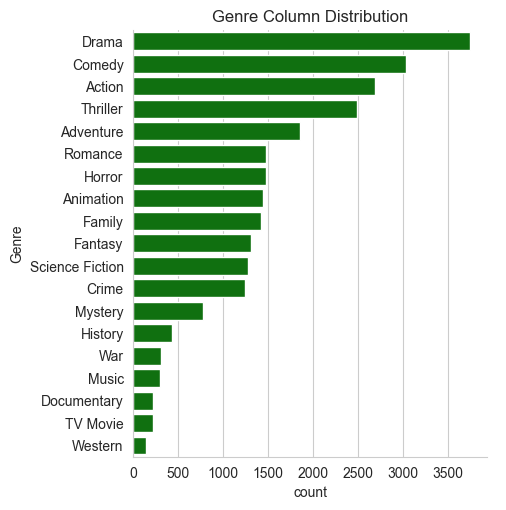
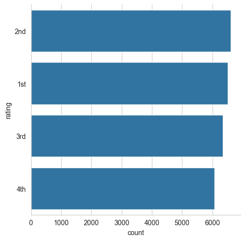
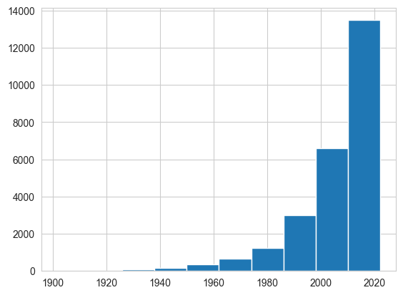

# 🎬 Netflix Movies Data Analysis (Mini Project)

This is a mini data analysis project based on a Netflix movie dataset. The goal was to explore the dataset, clean it, extract insights, and visualize trends in movie genres, popularity, ratings, and release years.

---

## 📁 Dataset

The dataset (`movie.csv`) contains various details about Netflix movies, including:
- Movie Title
- Genre
- Popularity
- Vote Count
- Vote Average
- Release Date
- Language, Overview, etc.

---

## 🧼 Data Preprocessing

Steps performed:
- Removed unwanted columns like `Overview`, `Poster_Url`, etc.
- Converted `Vote_Count` and `Vote_Average` to numeric data types
- Converted `Release_Date` to datetime and extracted the release year
- Handled missing values and duplicates
- Split multiple genres per movie into separate rows

---

## 📊 Analysis & Visualizations

Key business questions answered:
- ✅ What is the most frequent genre of movies released on Netflix?
- ✅ What genres have the highest votes?
- ✅ Which movie got the highest and lowest popularity?
- ✅ Which year had the most movie releases?

Visuals used:
- `countplot`
- `catplot`
- `histplot`

> Most frequent genre: **Drama**  
> Highest popularity movie: **(Revealed in output)**  
> Peak movie release year: **2020**

---

## 🛠 Tools & Libraries Used

- Python
- Pandas
- Matplotlib
- Seaborn
- Jupyter Notebook

---

## 📌 Project Status

✅ Completed basic EDA and visualizations  
🧪 Next Step: Try model building or recommendation system

---

## 📸 Sample Visual

---

## ✍️ Author

**Milind Chaudhari**  
Data Science Learner | Python Enthusiast

---

## 📎 License

This project is open-source and free to use under the MIT License.

